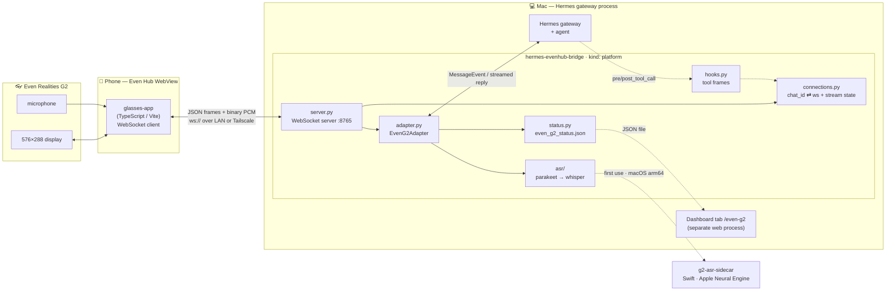
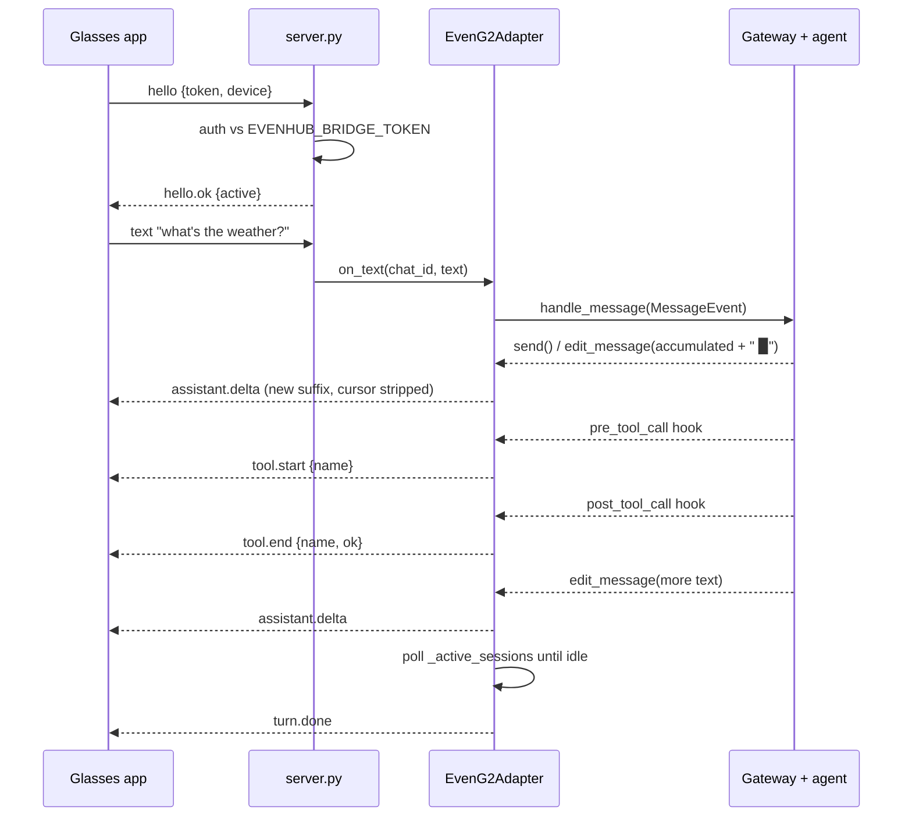
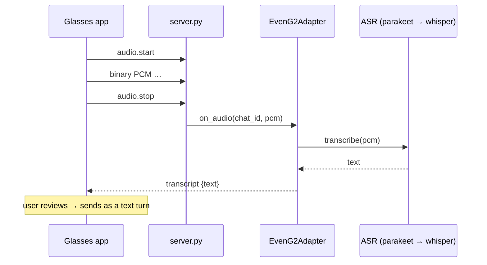

# hermes-evenhub-bridge

**Even Realities G2 smart glasses as a first-class [Hermes](https://github.com/NousResearch/hermes-agent) platform.**

This plugin registers `even_g2` as a Hermes gateway platform. It hosts a WebSocket
that the glasses connect to over your LAN or Tailscale; inbound text and voice are
dispatched through the Hermes gateway, and the agent's streamed reply, tool-call
status, session switching, and transcripts flow back to the glasses' 576×288 display.
G2 shows up under **Connected Platforms** with a dedicated **Even Realities G2**
dashboard tab.

> **This repo is the Hermes-side plugin only.** The glasses-side app — the TypeScript
> Even Hub WebView app that runs on the phone and renders to the G2 — lives in the
> [`even-g2-hermes`](https://github.com/huntsyea/even-g2-hermes) monorepo under
> `glasses-app/`. The two halves talk only through the JSON frame protocol described
> below.

---

## Contents

- [What it does](#what-it-does)
- [Architecture](#architecture)
- [The wire protocol](#the-wire-protocol)
- [How a turn works](#how-a-turn-works)
- [Install](#install)
- [Configuration](#configuration)
- [Networking (Tailscale / LAN)](#networking-tailscale--lan)
- [Voice / ASR](#voice--asr)
- [Dashboard](#dashboard)
- [CLI](#cli)
- [FAQ](#faq)
- [Troubleshooting](#troubleshooting)
- [Development](#development)

---

## What it does

- **Bridges the glasses to your agent.** Text you speak or type on the glasses becomes
  a gateway turn; the agent's reply streams back token-by-token to the tiny display.
- **Streams as deltas.** The gateway hands the adapter the *full accumulated* reply on
  every update; the adapter diffs it into append-only `assistant.delta` frames so the
  glasses only ever receive new text.
- **Shows tool activity.** Global `pre/post_tool_call` hooks emit `tool.start` /
  `tool.end` frames, scoped to the device whose active session matches.
- **Transcribes voice on-device.** Mic audio is streamed as PCM and transcribed locally
  (parakeet on Apple Neural Engine, or whisper-tiny as a universal fallback).
- **Self-installs.** `hermes plugins install` + one gateway restart pulls the Python
  dependencies and (on macOS) the ASR sidecar automatically.

---

## Architecture



| Module | Responsibility |
|---|---|
| `server.py` | WebSocket transport: hello auth against `EVENHUB_BRIDGE_TOKEN`, PCM buffering between `audio.start`/`audio.stop`, routing inbound frames to adapter `on_*` callbacks. |
| `adapter.py` (`EvenG2Adapter`) | The Hermes `BasePlatformAdapter`. Owns the gateway integration: dispatches messages, diffs streamed text into deltas, emits `turn.done`, drives transcription. |
| `connections.py` | Maps `chat_id → websocket` and holds per-chat `StreamState` (the delta cursor). Survives reconnects without dropping a newer socket. |
| `asr/` | Pluggable transcription: a registry of backends with automatic whisper fallback. |
| `hooks.py` | Global tool-call hooks → `tool.start`/`tool.end`, scheduled onto the adapter's loop via `run_coroutine_threadsafe` (hooks may fire off-loop). |
| `net.py` | Discovers the reachable bridge URL (Tailscale MagicDNS → Tailscale IP → LAN IP) and the bind host. |
| `status.py` | Writes `~/.hermes/even_g2_status.json` so the dashboard (a separate process) can read live device status. |
| `_bootstrap.py` | Installs the plugin's Python deps on first load (Hermes doesn't do this for git-installed plugins). |
| `dashboard/` | `manifest.json` + a hand-written `dist/index.js` (no build step) + `plugin_api.py` (FastAPI routes). |

---

## The wire protocol

`server.py` ⇄ glasses app speak one JSON frame protocol (plus raw binary PCM during
an audio stream). Every frame has a `t` (type) field.

**Client → bridge**

| Frame | Payload | Meaning |
|---|---|---|
| `hello` | `token`, `device` | Authenticate + identify the device (this is the `chat_id`). |
| `text` | `text` | A typed/confirmed message → starts a turn. |
| `stop` | — | Interrupt the current turn (`/stop`). |
| `sessions.list` | — | Request the session list. |
| `sessions.switch` | `id` | Switch the active session. |
| `sessions.new` | — | Start a new session (`/new`). |
| `audio.start` / `audio.stop` | — | Bracket a PCM stream; raw binary frames in between are the audio. |

**Bridge → client**

| Frame | Payload | Meaning |
|---|---|---|
| `hello.ok` | `active`, `caps` | Handshake accepted. |
| `assistant.delta` | `text` | Append-only chunk of the reply. |
| `tool.start` / `tool.end` | `name`, `ok` | A tool began / finished. |
| `turn.done` | — | The turn is complete (the gateway's per-turn guard cleared). |
| `sessions` | `items`, `active` | The session list. |
| `active` | `id` | The active session changed. |
| `transcript` | `text` | A voice transcription result. |
| `error` | `msg` | A recoverable error; the connection stays open. |

> **The protocol is a contract.** `protocol.py` here and `protocol.ts` in the glasses
> app must stay in sync. Either side may change internals freely as long as these
> frames hold.

---

## How a turn works

**A text turn** — note the gateway gives the adapter *accumulated* text, which the
adapter diffs into deltas, and `turn.done` comes from polling the gateway's idle guard
(not from the streaming finalize flag, which fires at every tool boundary):



**A voice turn** — PCM is buffered by `server.py`, transcribed on `audio.stop`, and
returned for the user to confirm before it's sent as a `text` turn:



---

## Install

```bash
hermes plugins install huntsyea/hermes-evenhub-bridge
```

Then:

1. **Set the pairing secret** in `~/.hermes/.env`:
   ```
   EVENHUB_BRIDGE_TOKEN=<shared-secret>
   ```
   The platform reports **unavailable** until this is set.
2. **Enable and restart:**
   ```bash
   hermes plugins enable hermes-evenhub-bridge
   hermes gateway restart
   ```
   The first start **auto-installs** `websockets`, `numpy`, and `faster-whisper` into
   the Hermes environment (Hermes itself never pip-installs plugin deps). This can take
   a few minutes on a cold cache; if it can't (offline / no pip), the platform registers
   disabled with a clear message and you can install `requirements.txt` manually.
3. **Point the glasses at the bridge.** Get the URL:
   ```bash
   hermes-evenhub-bridge url
   ```
   Put it in the glasses app's `.env.local` as `VITE_BRIDGE_LAN_URL`, and add it to
   `app.json`'s `network` whitelist (exact match).
4. **Approve pairing.** A newly connected device is pairing-gated — its first turn
   returns a code:
   ```bash
   hermes pairing approve even_g2 <code>
   ```

---

## Configuration

All configuration is environment variables (in `~/.hermes/.env` or the gateway env).

| Variable | Default | Purpose |
|---|---|---|
| `EVENHUB_BRIDGE_TOKEN` | — (**required**) | Shared pairing secret; the hello handshake is rejected without it. |
| `EVENHUB_BRIDGE_HOST` | `0.0.0.0` | WebSocket bind host. |
| `EVENHUB_BRIDGE_PORT` | `8765` | WebSocket bind port. |
| `EVENHUB_BRIDGE_NET` | `both` | Reachability mode: `both` \| `tailnet` \| `lan` (see below). |
| `EVENHUB_ASR_MODEL` | — | Force the active ASR model (highest precedence). |
| `EVENHUB_ASR_SIDECAR_BIN` | `~/.hermes/even_g2/bin/g2-asr-sidecar` | Path to the parakeet sidecar binary. |
| `EVENHUB_ASR_SIDECAR_REPO` | `huntsyea/hermes-evenhub-bridge` | GitHub repo to fetch the prebuilt sidecar from (forks/mirrors). |
| `EVENHUB_ASR_STATE` | `~/.hermes/even_g2_asr.json` | Active-model state file (written by `asr set`). |

---

## Networking (Tailscale / LAN)

A raw LAN IP breaks the moment the phone leaves the Wi-Fi, so the bridge prefers
**Tailscale** when it's available and advertises a stable URL the glasses can use from
anywhere on your tailnet.

- **URL precedence:** Tailscale MagicDNS name → Tailscale IP → LAN IP. A pinned
  `EVENHUB_BRIDGE_HOST` (a specific interface) overrides this so the advertised URL
  always matches what the socket actually binds.
- **`EVENHUB_BRIDGE_NET`:**
  - `both` (default) — bind `0.0.0.0` (reachable on LAN *and* tailnet), advertise the tailnet name.
  - `tailnet` — bind the Tailscale interface only (most private).
  - `lan` — bind `0.0.0.0`, advertise the LAN IP, skip Tailscale detection entirely.
- Tailscale is detected via `tailscale status --json`; if it's not running or you're
  logged out, the bridge falls back to the LAN IP. **It never installs or brings up
  Tailscale** — that's on you.

The advertised URL is shown by `hermes-evenhub-bridge url`, on the dashboard ("Glasses
URL"), and in the status file.

---

## Voice / ASR

Transcription is pluggable and **degrades gracefully** — a voice command always
produces a transcript:

| Model | Backend | Platform | Notes |
|---|---|---|---|
| `parakeet-tdt-0.6b-v2` | Swift FluidAudio sidecar | macOS (Apple Silicon) | **Default.** Fast, runs on the Neural Engine. |
| `parakeet-tdt-0.6b-v3` | Swift FluidAudio sidecar | macOS (Apple Silicon) | Multilingual. |
| `whisper-tiny` | faster-whisper (CPU) | any | **Universal fallback.** Weights self-download on first use. |

- **Active model resolution:** `EVENHUB_ASR_MODEL` env > state file (`asr set`) > default.
- **Sidecar auto-download:** on macOS/arm64, the first time you download a parakeet
  model the prebuilt sidecar binary is fetched from this repo's GitHub Releases
  (checksum-verified, streamed to disk), so there's nothing to build. On any other
  platform, or if the download fails, transcription stays on `whisper-tiny`.
- If the active model's backend can't run (sidecar missing, crash, timeout), the
  adapter falls back to `whisper-tiny` for that request — it never lets ASR kill a turn.

> The sidecar binary is **Developer ID signed + notarized** (Apple notary: Accepted) with
> the hardened runtime, so it runs without Gatekeeper prompts. (It's a bare CLI tool, not an
> app bundle, so there's no staple — the notarization ticket is served online; the plugin's
> download applies no quarantine.)

---

## Dashboard

The **Even Realities G2** tab at `/even-g2` shows live status (connected devices, mic
state, active session), the **Glasses URL** to paste into the app, and the ASR model
picker with a one-click **Download** for the parakeet sidecar. Backend routes mount at
`/api/plugins/hermes-evenhub-bridge/`. Because the dashboard runs in a separate web
process from the gateway, live status crosses the boundary via a small JSON status file.

---

## CLI

```bash
hermes-evenhub-bridge url                 # print the ws:// URL the glasses should use
hermes-evenhub-bridge asr list            # list models + which are installed/active
hermes-evenhub-bridge asr download <name> # fetch a model (auto-downloads the sidecar on macOS)
hermes-evenhub-bridge asr set <name>      # set the active model (takes effect next voice command)
```

---

## FAQ

**Do I need the sidecar / a Swift toolchain?**
No. `whisper-tiny` works everywhere out of the box. The parakeet sidecar is an optional
macOS speed-up that auto-downloads — you never build it unless you're hacking on it.

**Does it work when my phone is on cellular / a different network?**
Yes, if both the Mac and the phone are on the same Tailscale tailnet — that's exactly
what the Tailscale URL is for. On the same LAN, the LAN IP works too.

**Why does the first `hermes gateway restart` after install take a while?**
It's the one-time dependency install. Subsequent starts are instant (a fast import
probe). If it fails it won't re-hang every restart — it records a cooldown and tells you
how to install manually.

**Does the plugin install or configure Tailscale for me?**
No. It only *detects* an existing Tailscale and advertises its address. Installing and
`tailscale up` are up to you.

**Is the glasses app in this repo?**
No — this repo is the Hermes-side plugin. The glasses app is in the
[`even-g2-hermes`](https://github.com/huntsyea/even-g2-hermes) monorepo.

**How do I update after a new release?**
```bash
hermes plugins update hermes-evenhub-bridge && hermes gateway restart
```

---

## Troubleshooting

| Symptom | Likely cause / fix |
|---|---|
| Platform shows **unavailable** | `EVENHUB_BRIDGE_TOKEN` isn't set, or dependency auto-install failed (check the gateway log for "dependencies still missing" and install `requirements.txt` manually). |
| Glasses can't connect | Wrong URL or token. Re-run `hermes-evenhub-bridge url`; ensure the exact URL is in the app's `app.json` `network` whitelist; confirm the same token on both sides. |
| First turn returns a code, not a reply | Pairing gate — run `hermes pairing approve even_g2 <code>`. |
| Voice always uses whisper, never parakeet | Not on macOS/arm64, the sidecar download failed, or Gatekeeper blocked the unsigned binary (approve it in Privacy & Security). |
| "Connected Platforms" pill shows `even_g2`, not the label | A stock Hermes frontend limitation (it renders the raw platform key). Not a bug here. |

---

## Development

Develop in the [`even-g2-hermes`](https://github.com/huntsyea/even-g2-hermes) monorepo
(`bridge/`), where the Swift sidecar source (`bridge/sidecar/`) and the glasses app
(`glasses-app/`) live. This standalone repo is **published** from that monorepo by a
`git subtree split` of `bridge/src/hermes_evenhub_bridge/` — don't commit here directly.

```bash
cd bridge
uv sync
uv run pytest -q          # full suite
```

The prebuilt sidecar is published to this repo's Releases by CI on a `sidecar-v<version>`
tag; build it from source with `cd bridge/sidecar && swift build -c release`.
