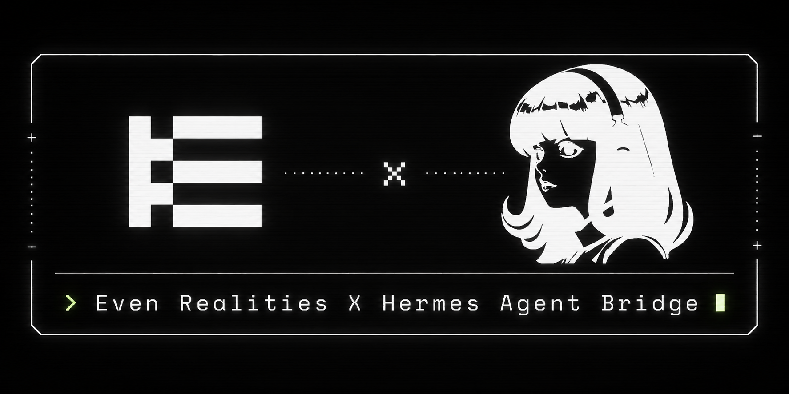

# hermes-evenhub-bridge



**Even Realities G2 smart glasses as a first-class [Hermes](https://github.com/NousResearch/hermes-agent) platform.**

This plugin registers `even_g2` as a Hermes gateway platform. It hosts a WebSocket that the
glasses connect to over your LAN or Tailscale; inbound text and voice are dispatched through
the Hermes gateway, and the agent's streamed reply, tool-call status, session switching, and
transcripts flow back to the glasses' 576×288 display.

> **This repo is the Hermes-side plugin only.** The glasses-side app (the TypeScript Even Hub
> WebView app that runs on the phone) lives in the
> [`even-g2-hermes`](https://github.com/huntsyea/even-g2-hermes) monorepo under `glasses-app/`.
> The two halves talk only through the [JSON frame protocol](docs/protocol.md).



## What it does

- **Bridges the glasses to your agent** — text or voice on the glasses becomes a gateway turn;
  the reply streams back token-by-token to the tiny display.
- **Streams as deltas** — the adapter diffs the gateway's accumulated reply into append-only
  `assistant.delta` frames, and surfaces tool activity (`tool.start`/`tool.end`).
- **Transcribes voice on-device** — parakeet on the Apple Neural Engine, with a universal
  `whisper-tiny` fallback.
- **Self-installs** — `hermes plugins install` + one gateway restart pulls the Python deps automatically;
  on macOS, the signed ASR sidecar is fetched when you download a parakeet model.

## Install

```bash
hermes plugins install huntsyea/hermes-evenhub-bridge
```

Then:

1. **Set the pairing secret** in `~/.hermes/.env` — `EVENHUB_BRIDGE_TOKEN=<shared-secret>`
   (the platform is unavailable until this is set). Treat it like a root credential — see
   [SECURITY.md](SECURITY.md).
2. **Enable and restart** — `hermes plugins enable hermes-evenhub-bridge && hermes gateway restart`.
   The first start auto-installs `websockets`/`numpy`/`faster-whisper` (a few minutes on a cold
   cache; falls back to a clear "install manually" message if it can't).
3. **Point the glasses at the bridge** — run `hermes even-g2 url`, put it in the glasses
   app's `.env.local` (`VITE_BRIDGE_LAN_URL`) and `app.json` `network` whitelist (exact match).
4. **Approve pairing** — the first turn returns a code: `hermes pairing approve even_g2 <code>`.

## Docs

- [Architecture](docs/architecture.md) — components, the streaming/turn-done internals, and the turn sequence diagrams
- [Wire protocol](docs/protocol.md) — the client/server frame contract
- [Configuration](docs/configuration.md) — env vars, Tailscale networking, ASR, dashboard, CLI
- [FAQ & troubleshooting](docs/faq.md)
- [Security](SECURITY.md) · [Contributing](CONTRIBUTING.md) · [Third-party notices](THIRD_PARTY_NOTICES.md)

## License

[MIT](LICENSE) © Hunter Yeagley
