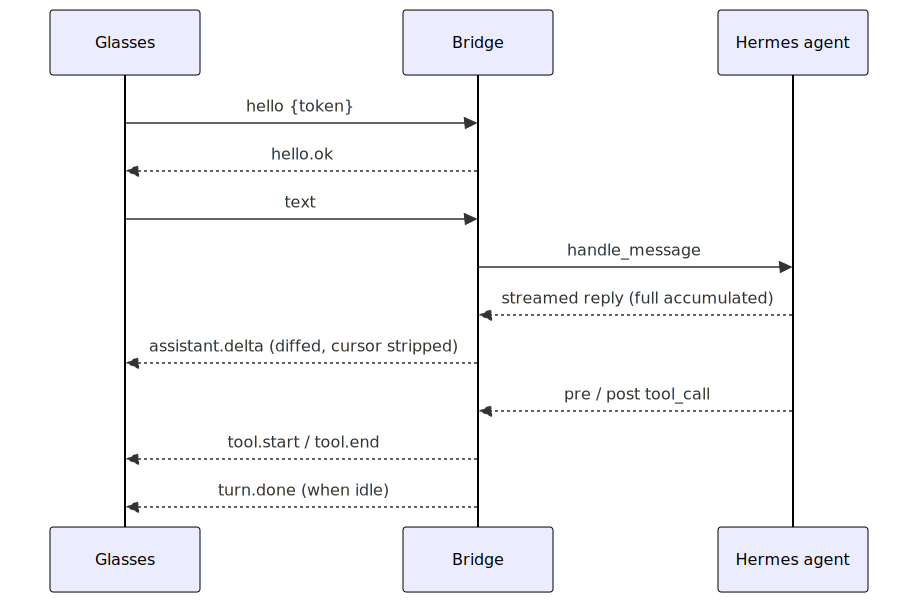
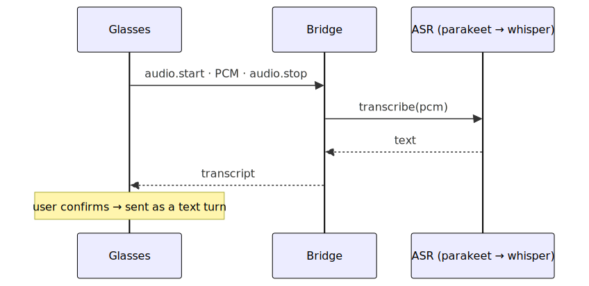

# Architecture

## Modules

| Module | Responsibility |
|---|---|
| `server.py` | WebSocket transport: hello auth against `EVENHUB_BRIDGE_TOKEN`, PCM buffering between `audio.start`/`audio.stop` (size-capped), routing inbound frames to adapter `on_*` callbacks. |
| `adapter.py` (`EvenG2Adapter`) | The Hermes `BasePlatformAdapter`. Owns the gateway integration: dispatches messages, diffs streamed text into deltas, emits `turn.done`, drives transcription. |
| `connections.py` | Maps `chat_id → websocket` and holds per-chat `StreamState` (the delta cursor). Survives reconnects without dropping a newer socket. |
| `asr/` | Pluggable transcription: a registry of backends with automatic whisper fallback. |
| `hooks.py` | Global tool-call hooks → `tool.start`/`tool.end`, scheduled onto the adapter's loop via `run_coroutine_threadsafe` (hooks may fire off-loop). |
| `net.py` | Discovers the reachable bridge URL (Tailscale MagicDNS → Tailscale IP → LAN IP) and the bind host. |
| `status.py` | Writes `~/.hermes/even_g2_status.json` so the dashboard (a separate process) can read live device status. |
| `_bootstrap.py` | Installs the plugin's Python deps on first load (Hermes doesn't do this for directory plugins). |
| `dashboard/` | `manifest.json` + a hand-written `dist/index.js` (no build step) + `plugin_api.py` (FastAPI routes). |

## How a turn works

**Text turn** — the gateway hands the adapter the *full accumulated* reply, which the
adapter diffs into append-only deltas; `turn.done` comes from polling the gateway's idle
guard (not the streaming finalize flag, which fires at every tool boundary):

**Voice turn** — PCM is buffered by `server.py`, transcribed on `audio.stop`, and returned
for the user to confirm before it's sent as a `text` turn:

## Non-obvious details

- **Streaming → deltas.** The gateway carries a trailing `" ▉"` streaming cursor;
  `StreamState.delta_for()` strips that exact cursor (not `rstrip`, so real trailing spaces
  survive) and returns only the unsent suffix. Don't assume `send/edit_message` give deltas.
- **`turn.done`** fires when the gateway's per-turn `_active_sessions[session_key]` guard
  clears, tracked by a per-chat poller that's replaced each turn (with a short grace window
  for chained turns).
- **Status file IPC.** The dashboard runs in a separate web-server process, so live device
  status crosses the boundary via `~/.hermes/even_g2_status.json`.
- **Self-bootstrap.** `register()` installs `requirements.txt` into the gateway interpreter
  *before* importing the adapter (which imports `websockets`/`numpy` at module load); on
  failure it registers the platform disabled instead of crashing plugin load.

> Diagrams are generated from `docs/diagrams/*.mmd` via `scripts/render-diagrams.sh`.
